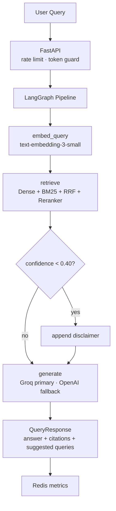

# healthCare.AI

---

- **Live Link** — [health-care-ai-one.vercel.app](https://health-care-ai-one.vercel.app)
- **Observability Dashboard** — Engineering tab on the live app
- **Source Documents** — FDA Metformin Label · ADA Standards 2023 §6, §9 · JNC 8 Hypertension Guidelines
- **Experiment Metrics** — `experiments/chunking/results/summary.json` · MLflow runs in `experiments/chunking/mlruns/`

---

## Table of Contents

1. [Project Overview](#project-overview)
2. [Project Objective](#project-objective)
3. [Project Scope](#project-scope)
4. [Development Workflow](#development-workflow)
5. [Architecture](#architecture)
6. [File Structure](#file-structure)
7. [Decisions / Trade-offs](#decisions--trade-offs)
8. [Final Tech Stack](#final-tech-stack)
9. [Repo Setup](#repo-setup)
10. [Experiments Setup](#experiments-setup)
11. [AI Tools Usage Overview](#ai-tools-usage-overview)

---

## Project Overview

### Problem

Pharmacists, care coordinators, and clinical informatics teams need fast, accurate answers from authoritative clinical documents — FDA drug labels, ADA diabetes guidelines, JNC hypertension guidelines — during active consultations. Current approach: manual PDF search under time pressure. Risks: wrong dosage, missed contraindications, outdated guidance from LLM training data.

Hallucination is zero-tolerance in this domain. Possible failures:
- Wrong dosage generation
- Incorrect contraindications stated
- Multiple guidelines mixed without attribution
- Outdated medical advice from LLM training data

### Solution

A production RAG (Retrieval-Augmented Generation) system. Not a demo - a system with defined SLAs, observable behavior, and a CI pipeline that enforces quality before every deploy.

Natural-language queries against authoritative clinical documents, with grounded, cited answers.

- Retrieves trusted documents instead of relying on LLM background knowledge
- Generates extractive answers (1–3 sentences) with inline citations
- Flags low-confidence answers with an in-line disclaimer instead of suppressing them
- Blocks deploys when evaluation falls below threshold

### Project Requirements

Full requirements doc: [docs/project_context.md](docs/project_context.md)

**User base:**
- Primary: Pharmacists at health plan/PBM verifying drug appropriateness (dosing, contraindications)
- Secondary: Care coordinators looking up clinical guidelines
- Not: Direct patient use - clinically trained professionals only
- ~10 concurrent users · ~500 queries/day (prototype scale)

**Latency SLAs:**
| Percentile | Target |
|---|---|
| p50 | < 800ms |
| p95 | < 2,500ms |
| p99 | < 5,000ms |

**Accuracy thresholds (RAGAS):**
| Metric | Threshold |
|---|---|
| Faithfulness | ≥ 0.70 (CI gate blocks deploy below this) |
| Answer Relevancy | > 0.75 |
| Context Precision | > 0.70 |
| Confidence gate | below 0.40 → disclaimer appended to answer |

---

## Project Objective

Purpose: demonstrating production-level architecture thinking, a working RAG system, and transparent AI tool usage in an AI/ML engineering context.

**What this demonstrates:**
- Production RAG pipeline design — hybrid retrieval, reranking, confidence scoring, LangGraph orchestration
- System design thinking — SLAs defined upfront, failure modes planned, observability designed before implementation
- Evaluation-driven development — RAGAS eval set covering edge cases, CI gate blocking deploys on quality regression
- Transparent AI usage — every Claude Code / other AI tools session logged with the spec that preceded it

---

## Project Scope


The corpus is deliberately constrained (4 documents, ~280 chunks at 512 tokens) to stress-test retrieval quality rather than demonstrate scale. The architecture decisions, CI pipeline, observability layer, and evaluation harness are designed for production.

Future work documented in [docs/decision.md](docs/decision.md):
- A/B evaluation on chunk size per document type with type-specific chunking configs
- Kubernetes instead of docker-compose at production scale
- Grafana for metrics dashboards
- Answer caching for cost optimization on frequent queries

---

## Development Workflow

Architecture and decisions written before code. Every AI interaction traceable.

**Step 1 — Document inspection (No AI)**

Read the raw PDFs manually before writing any code. Recorded observations about section boundaries, table structure, header/footer noise, abbreviation patterns, and clinical formatting rules per document.
- [docs/preprocessing_specs_dev.md](docs/preprocessing_specs_dev.md) — manual observations per PDF
- [docs/preprocessing_spec_ai.md](docs/preprocessing_spec_ai.md) — AI-assisted document analysis

**Step 2 — Architecture & decisions (No AI)**

System design written before any code — chunking strategy, retrieval model selection, confidence threshold rationale, failure mode planning.
- [docs/basic_architecture.md](docs/basic_architecture.md)
- [docs/decision.md](docs/decision.md)

**Step 3 — Chunking experiments (AI for code only)**

Systematic ablation across 3 strategies × 3 token sizes = 9 configurations. Each configuration chunked all 4 documents, retrieved context for eval questions, scored with RAGAS, and logged to MLflow.
- Results: `experiments/chunking/results/summary.json`
- AI usage log: [ai_usage/dev_decisions_eval.md](ai_usage/dev_decisions_eval.md)

**Step 4 — Eval set design (Spec by me · Generated by AI)**

30 Q&A pairs covering 7 categories: chunking boundary breaks, cross-document reasoning, normalization failures, safety-critical retrieval, out-of-scope confidence gating, table-derived questions, and adversarial hallucination traps. Format spec written first, then AI generated questions against the spec. All reviewed manually.
- [docs/eval_ques_format.md](docs/eval_ques_format.md)
- `data/evaluation/`

**Step 5 — Observability design (No AI)**

Per-query metrics schema, latency stage breakdown, drift detector spec — all written as pseudocode before implementation began.
- [docs/observability_specs.md](docs/observability_specs.md)

**Step 6 — UI specification (No AI)**

Full UI requirements and component hierarchy written as a spec referencing Optum Clinical Assistant and Stanford health AI three-pane workspace design. Mockup reviewed before any code.
- [docs/ui_requirements.md](docs/ui_requirements.md)

**Step 7 — Implementation (Claude Code and others, spec-driven)**

Backend, eval harness, and UI built module-by-module with Claude Code and others. Every session was preceded by a written spec. Full session transcripts in `ai_usage/`.
- [ai_usage/logic_building.md](ai_usage/logic_building.md)
- [ai_usage/testing.md](ai_usage/testing.md)
- [ai_usage/ui_building.md](ai_usage/ui_building.md)

---

## Architecture

### Request flow

```
POST /query
   │
   ▼
FastAPI (rate limit · token guard · PHI: query never logged)
   │
   ▼
LangGraph StateGraph
   │
   ├─► embed_query node
   │     └─ OpenAI text-embedding-3-small → query vector
   │
   ├─► retrieve node
   │     ├─ Dense search — Qdrant cosine (top-30)
   │     ├─ BM25 keyword search — in-memory corpus (top-30)
   │     ├─ RRF fusion — k=30, BM25 weight 1.3
   │     ├─ Cross-encoder reranker — ms-marco-MiniLM-L-6-v2 (top-3 to LLM)
   │     └─ Confidence scorer — top-1 reranker sigmoid → score
   │
   └─► generate node
         ├─ Primary LLM — Groq llama-3.3-70b-versatile (~300ms)
         ├─ Fallback LLM — OpenAI gpt-4o-mini (on Groq rate limit)
         ├─ Suggestions — llama-3.1-8b-instant (concurrent, adds 0ms latency)
         └─ Degraded answer — if all retries exhausted, return sources only
   │
   ▼
QueryResponse (answer · sources · confidence · suggested_queries · warning_message)
```

### Mermaid diagram



### Data ingestion pipeline (batch, runs once)

```
PDF → PyMuPDF + pdfplumber extraction
    → Custom cleaner (headers, footers, references, abbreviation expansion)
    → Section-aware chunker (512 tokens, 64-token overlap)
    → OpenAI text-embedding-3-small
    → Qdrant upsert (vector + metadata payload)
    → BM25 corpus saved to data/cache/bm25_corpus.pkl
    → MLflow run logged
```

### Observability

- Per-query metrics to Redis: latency by stage (embed/retrieve/generate), confidence score, doc_ids retrieved
- Drift detection: centroid cosine distance on each new document batch vs. index baseline. Alert threshold 0.15 (conservative — rather alert more than miss real drift)
- CI eval gate: 30 questions on every push. Faithfulness < 0.70 → block deploy

---

## File Structure

```
Healthcare_AI/
├── configs/                        — LLM + retrieval config dataclasses
│   ├── llm.py                      — Groq/OpenAI model config, system prompt
│   ├── retrieval.py                — Dense, BM25, RRF, reranker, confidence thresholds
│   └── embedding.py                — Embedder config
│
├── data/
│   ├── raw/                        — Source PDFs (4 documents)
│   ├── cache/                      — BM25 corpus pkl (generated by ingestion)
│   └── evaluation/                 — Eval Q&A pairs (JSON)
│
├── docs/                           — Architecture, decisions, specs (written before code)
│   ├── basic_architecture.md       — System design
│   ├── decision.md                 — All trade-off decisions with rationale
│   ├── preprocessing_specs_dev.md  — Manual PDF observations
│   ├── preprocessing_spec_ai.md    — AI-assisted document analysis
│   ├── eval_ques_format.md         — Eval set design spec
│   ├── observability_specs.md      — Metrics + drift detector pseudocode
│   ├── ui_requirements.md          — UI spec
│   └── local_setup.md              — Full setup guide
│
├── ai_usage/                       — All AI session traces (Claude Code, Antigravity, Figma Make)
│   ├── logic_building.md           — Backend implementation sessions
│   ├── testing.md                  — Test sessions
│   ├── dev_decisions_eval.md       — Experiment code sessions
│   └── ui_building.md              — Frontend sessions
│
├── src/
│   ├── ingestion/                  — PDF parsing, custom cleaning, chunking
│   ├── embedding/                  — OpenAI embedder, BGE embedder, indexer
│   ├── retrieval/                  — Dense retriever, BM25, RRF, cross-encoder, confidence
│   ├── orchestration/              — LangGraph graph + embed/retrieve/generate nodes
│   ├── serving/                    — FastAPI app, request/response schemas
│   ├── evaluation/                 — RAGAS runner, confidence checker
│   └── monitoring/                 — Per-query metrics, drift detection, JSON logging
│
├── experiments/
│   ├── chunking/                   — 9-config ablation (3 strategies × 3 token sizes), MLflow
│   └── preprocessing/              — Extraction method comparison (PyMuPDF vs pdfplumber vs langchain)
│
├── tests/
│   ├── unit/                       — Per-module unit tests
│   └── integration/                — End-to-end pipeline tests
│
├── scripts/
│   ├── run_ingestion.py            — Ingest PDFs into Qdrant (run once)
│   ├── create_qdrant_collection.py — Create collection with payload indexes (run once)
│   └── build_bm25_index.py         — Rebuild BM25 corpus from existing chunks
│
├── ui/chat_assistant/              — React + Tailwind + Radix UI frontend
├── docker/                         — docker-compose (Qdrant + Redis)
├── .github/workflows/              — CI: lint → unit tests → integration → eval gate
├── eval_report.json                — Latest RAGAS eval output (per-question scores)
├── Dockerfile                      — Production container
└── pyproject.toml                  — Ruff, pytest, coverage config
```

---

## Decisions / Trade-offs

Full doc with all rationale: [docs/decision.md](docs/decision.md)

**Hybrid retrieval — BM25 + dense, RRF k=30**
- Clinical acronyms (eGFR, SGLT2i, ACE, ARB) score poorly in dense-only search. BM25 catches exact keyword matches. RRF fuses both ranked lists without score normalisation.

**512-token chunks with boundary-aware splitting**
- Boundary-aware chunking respects paragraph and section structure to avoid splitting clinical thresholds mid-sentence. Tested 256/512/1024 — 512 scored highest on RAGAS context precision (0.79 vs 0.67 at 256, 0.85 at 1024 but with faithfulness drop to 0.875).
- Results: `experiments/chunking/results/summary.json`

**Confidence gate at 0.40 — warn alongside answer**
- Healthcare context: suppressing an answer is worse than flagging uncertainty. Low confidence appends a disclaimer but still returns the answer.

**Groq llama-3.3-70b-versatile primary + OpenAI gpt-4o-mini fallback**
- Groq cuts LLM latency from ~9s to ~300ms at zero cost on free tier. OpenAI fallback activates automatically on Groq RateLimitError. Embeddings remain on text-embedding-3-small (no Groq equivalent).

**Cross-encoder reranker (ms-marco-MiniLM-L-6-v2)**
- Re-scores top-60 RRF candidates. Only top-3 reach the LLM context window. Adds latency (~150ms on CPU) but improves context precision meaningfully.

**LangGraph StateGraph for orchestration**
- Multiple pipeline stages with shared state, retry logic, and clear debugging. Graph handles state propagation — no global variables, thread-safe for concurrent requests.

**Redis for metrics, not an existing observability tool**
- Deliberate choice: building custom metrics storage gives better understanding of how production metrics systems work. Grafana would be the production replacement.

**Custom preprocessing over LangChain default loaders**
- Documents have high noise (repeating headers, multi-column layouts, broken abbreviations). Custom cleaner handles per-document rules validated by manual reading. pdfplumber for table extraction, PyMuPDF for bulk text.

---

## Final Tech Stack

| Layer | Technology |
|---|---|
| LLM (primary) | Groq llama-3.3-70b-versatile |
| LLM (fallback) | OpenAI gpt-4o-mini |
| LLM (suggestions) | Groq llama-3.1-8b-instant |
| Embeddings | OpenAI text-embedding-3-small (1536d) |
| Orchestration | LangGraph StateGraph |
| Vector DB | Qdrant (self-hosted Docker) |
| Keyword search | BM25 (rank-bm25, in-memory) |
| Reranker | ms-marco-MiniLM-L-6-v2 (cross-encoder, CPU) |
| Backend API | FastAPI + uvicorn (async) |
| Rate limiting | slowapi (5/day guest · 25/day signed-in) |
| Evaluation | RAGAS (faithfulness, answer_relevancy, context_precision, context_recall) |
| Experiment tracking | MLflow |
| Observability | Redis (custom metrics), JSON structured logging |
| CI/CD | GitHub Actions (lint → unit → integration → eval gate) |
| Deployment | Railway (backend) · Vercel (frontend) |
| Frontend | React + Vite + Tailwind CSS v4 + Radix UI |
| Auth | Google OAuth 2.0 (implicit flow, @react-oauth/google) |
| Containerisation | Docker + docker-compose |

---

## Repo Setup


**Prerequisites:** Python 3.11–3.12 · Node 18/20 · pnpm 8+ · Docker Desktop · OpenAI API key

```powershell
# 1. Clone and create venv
git clone <repo-url>
cd Healthcare_AI
python -m venv .venv
.venv\Scripts\Activate.ps1

# 2. Install Python dependencies
pip install -r requirements.txt

# 3. Set environment variables (.env at repo root)
# Required: OPENAI_API_KEY
# Optional: GROQ_API_KEY, QDRANT_URL, REDIS_URL, QDRANT_API_KEY

# 4. Start Qdrant + Redis
docker compose -f docker/docker-compose.yml up -d

# 5. Create Qdrant collection (one-time)
$env:PYTHONPATH = "src"
python scripts/create_qdrant_collection.py

# 6. Ingest PDFs (one-time, ~3-8 min, ~$0.04 OpenAI cost)
python scripts/run_ingestion.py --provider openai

# 7. Start backend
uvicorn serving.api:app --host 0.0.0.0 --port 8000 --reload

# 8. Start frontend (new terminal)
cd ui/chat_assistant
pnpm install
pnpm dev
```

Open **http://localhost:5173** — backend must be running on port 8000.

**Running tests:**
```powershell
$env:PYTHONPATH = "src"
python -m pytest tests/unit/ -v
python -m pytest tests/integration/ -v
```

**Running RAGAS eval:**
```powershell
$env:PYTHONPATH = "src"
python src/evaluation/run_eval.py
# Outputs eval_report.json — served at GET /eval-report
```

---

## Experiments Setup

Full doc: [experiments/README.md](experiments/README.md)

Two experiment tracks ran before implementation:

**Preprocessing experiments** (`experiments/preprocessing/`)
- Compared PyMuPDF vs pdfplumber vs LangChain default loader across all 4 documents
- Decision: PyMuPDF for bulk text extraction, pdfplumber for table detection
- Report: `experiments/preprocessing/preprocessing_experiment_report.md`

**Chunking experiments** (`experiments/chunking/`)
- 3 strategies × 3 token sizes = 9 configurations
- Strategies: boundary-aware (production), fixed-size, sentence-window
- Token sizes: 256, 512, 1024
- Scored with RAGAS, tracked in MLflow

Best result: **boundary-aware 512-token** (mean RAGAS score 0.932, context precision 0.79, faithfulness 1.0 on smoke test set)

```powershell
cd experiments/chunking
pip install -r requirements.txt
python run_experiment.py                         # all 9 configs
python run_experiment.py --strategy boundary_aware  # single strategy
mlflow ui                                        # view results at localhost:5000
```

---

## AI Tools Usage Overview

Full session traces: [ai_usage/](ai_usage/)

**What AI did:**
- Experiment code — Python scripts for chunking ablations and RAGAS scoring loops. Reviewed and validated against manual spot-checks before results were used to make decisions.
- Implementation — Preprocessing, retrieval, and embedding modules built with Claude Sonnet via Antigravity. Eval harness, CI pipeline, and landing page built with Claude Code. Chat interface scaffolded with Figma Make, then refined with Claude Code.
- Testing — Unit and integration test skeletons. All assertions validated manually. Test coverage does not substitute for the RAGAS eval gate — both run in CI.

**What AI did not do:**
- Spec writing — architecture, decisions, observability design, eval set format, UI requirements all written before AI was invoked
- Document inspection — manual reading of all 4 PDFs before preprocessing rules were defined
- Eval set review — all 30 Q&A pairs reviewed manually regardless of how they were generated
- Architectural decisions — chunk size, retrieval strategy, confidence threshold all decided from experiment results, not AI suggestion

Every non-trivial decision is traceable to a spec written before AI was invoked. Session transcripts:
- [ai_usage/logic_building.md](ai_usage/logic_building.md) — backend modules
- [ai_usage/testing.md](ai_usage/testing.md) — unit and integration tests
- [ai_usage/dev_decisions_eval.md](ai_usage/dev_decisions_eval.md) — experiment scripts
- [ai_usage/ui_building.md](ai_usage/ui_building.md) — frontend sessions
