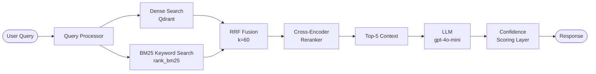

# Retrieval Pipeline — Implementation Plan & Config

> **Scope:** Hybrid Retrieval (Dense + BM25 → RRF → Cross-Encoder Reranker).  
> Based on `decision.md` decisions. Prototype-grade code, production-grade architecture.

---

## 1. Overall Architecture Flow



**Decision Alignment:**
| decision.md | Component |
|---|---|
| Hybrid Dense + BM25 | `DenseRetriever` + `BM25Retriever` |
| RRF with k=60 | `RRFRanker` |
| Cross-encoder reranker → top 5 | `CrossEncoderReranker` |
| LangGraph StateGraph | `RetrievalGraph` in `orchestration/` |
| FastAPI + async | `serving/api.py` |

---

## 2. New Directory Structure

```
src/
├── retrieval/
│   ├── __init__.py
│   ├── dense_retriever.py       # Qdrant vector search
│   ├── bm25_retriever.py        # BM25 over in-memory corpus
│   ├── rrf_ranker.py            # Reciprocal Rank Fusion
│   ├── reranker.py              # Cross-encoder reranker
│   ├── confidence.py            # Confidence scoring layer
│   └── pipeline.py              # Wires all stages (used by LangGraph node)
│
configs/
│   ├── __init__.py
│   ├── ingestion.py             # Ingestion-specific config (chunk size, overlap, etc.)
│   ├── retrieval.py             # ← PRIMARY NEW FILE (see Section 3)
│   ├── embedding.py             # Embedding model config
│   └── llm.py                   # LLM config
│
tests/unit/
│   ├── conftest.py              # sys.path fixture
│   ├── test_config.py           # 16 tests — DOC_REGISTRY structure
│   ├── test_cleaner.py          # 40 tests — all 8 cleaning stages
│   ├── test_normalizer.py       # 19 tests — normalization + abbreviation
│   ├── test_chunker.py          # 43 tests — FDA/ADA/JNC chunking + patterns
│   ├── test_table_converter.py  # 22 tests — NL table conversion
│   ├── test_extractor.py        # 17 tests — column sort, footer filter, mocked PDF
│   └── test_preprocessor.py    # 13 tests — end-to-end pipeline (mocked extractor)
```

> **Why a `configs/` folder separate from `src/`?**  
> Config is not business logic — it must be editable without touching pipeline code.  
> Separating it mirrors production patterns (e.g., Hydra, Pydantic Settings) and makes  
> overriding values per environment (dev / staging / prod) trivial.

---

## 3. `configs/retrieval.py` — Full Config with Rationale

```python
"""
configs/retrieval.py
--------------------
All tuneable knobs for the hybrid retrieval pipeline.
"""

from __future__ import annotations
from dataclasses import dataclass, field


@dataclass
class DenseConfig:
    collection_name: str = "healthcare_chunks"
    # Reason: Single collection per prototype. In prod namespace by corpus version.

    top_k: int = 20
    # Reason: Fetch 20 dense candidates before RRF. Google's RRF paper uses
    # 20–60 candidates per retriever. 20 is safe for a 4-doc corpus.

    distance_metric: str = "cosine"
    # Reason: text-embedding-3-small and BGE produce unit-normalised vectors.
    # Cosine == dot product on normalised vectors — Qdrant handles this efficiently.

    enable_metadata_filter: bool = True
    # Reason: Medical queries often constrain to a specific document.
    # Pre-filter reduces search space and raises precision (Qdrant's killer feature).

    filter_fields: list[str] = field(default_factory=lambda: [
        "document_id", "doc_type", "safety_flag",
    ])
    # Reason: Covers per-source grounding, doc-type routing, safety-content boosting.

    score_threshold: float | None = None
    # Reason: None by default — let RRF + reranker gate quality.
    # Set ~0.30 if irrelevant dense hits contaminate the fusion pool post-eval.


@dataclass
class BM25Config:
    top_k: int = 20
    # Reason: Mirror dense top_k so RRF fusion is symmetric.

    k1: float = 1.5
    # Reason: Standard Elasticsearch default. Well-validated on short biomedical text.

    b: float = 0.75
    # Reason: BM25 paper default. Works well for 512-token chunks (uniform length).

    corpus_cache_path: str = "data/cache/bm25_corpus.pkl"
    # Reason: BM25 is in-memory. Pickle the tokenised corpus to avoid
    # re-tokenising 1,000+ chunks on every API restart.
    # In production: use Redis-backed inverted index (OpenSearch/ES).

    tokenizer: str = "whitespace"
    # Reason: Medical text has meaningful compound tokens (HbA1c, mm Hg).
    # Whitespace tokeniser preserves them. spaCy would fragment "mm Hg" → ["mm","Hg"].


@dataclass
class RRFConfig:
    k: int = 60
    # Reason: Canonical RRF constant from Cormack & Clarke 2009 paper.
    # Empirically robust across IR tasks. Google's hybrid search uses k=60.

    dense_weight: float = 1.0
    bm25_weight: float = 1.0
    # Reason: Equal weights — medical acronyms make BM25 genuinely useful here.
    # Post-RAGAS eval: if context recall is low → bump dense_weight.
    # If context precision is low → bump bm25_weight.

    fusion_pool_size: int = 40
    # Reason: Top 40 candidates fed to reranker. More signal than 20 without
    # the quadratic cost of feeding all 80 candidates.


@dataclass
class RerankerConfig:
    model_name: str = "cross-encoder/ms-marco-MiniLM-L-6-v2"
    # Reason: Smallest MS-MARCO cross-encoder with solid reranking quality.
    # MiniLM-L-6 (22M params) runs on CPU in ~100ms for 40 candidates.
    # BGE reranker would be better but is 3× larger — unacceptable on free server.

    top_n: int = 5
    # Reason: Matches decision.md ("top 5 for final context").
    # 5 × 512-token chunks ≈ 2,560 tokens — safe headroom for LLM context window.

    batch_size: int = 32
    # Reason: Fits in 512MB RAM on free server (Render/Railway free tier).

    device: str = "cpu"
    # Reason: Free servers have no GPU. CPU inference with MiniLM-L-6 is fast enough.

    normalize_scores: bool = True
    # Reason: Sigmoid-normalised (0–1) scores feed cleanly into confidence layer.


@dataclass
class ConfidenceConfig:
    low_confidence_threshold: float = 0.40
    # Reason: Conservative. Will be tuned after RAGAS eval. Raise to 0.50 if
    # too many false warnings appear.

    warning_message: str = (
        "⚠️ Low confidence: The retrieved context may not fully support this answer. "
        "Please verify with the original clinical document."
    )
    # Reason: decision.md requires a warning flag to user when below threshold.

    return_answer_below_threshold: bool = True
    # Reason: "flag it to user with a warning ALONG the answer" (decision.md).
    # We don't suppress — that would break UX.

    score_source: str = "top1_reranker"
    # Reason: Top-ranked chunk's cross-encoder score is the best single proxy
    # for retrieval quality without a second LLM call.


@dataclass
class RetrievalConfig:
    dense: DenseConfig = field(default_factory=DenseConfig)
    bm25: BM25Config = field(default_factory=BM25Config)
    rrf: RRFConfig = field(default_factory=RRFConfig)
    reranker: RerankerConfig = field(default_factory=RerankerConfig)
    confidence: ConfidenceConfig = field(default_factory=ConfidenceConfig)


RETRIEVAL_CONFIG = RetrievalConfig()
```

---

## 4. `configs/ingestion.py` — Ingestion Config

```python
@dataclass
class ChunkingConfig:
    max_tokens: int = 512
    # Reason: Empirically validated (chunking experiment MLflow run).
    # 512 tokens ≈ 1 clinical paragraph.

    overlap_tokens: int = 64
    # Reason: 12.5% overlap. Enough to preserve cross-boundary context.
    # Standard guidance: 10–15%.

    min_chunk_tokens: int = 30
    # Reason: Chunks below 30 tokens (stray headings, single-line artefacts)
    # add noise to the vector index without retrieval value.

    tokenizer_encoding: str = "cl100k_base"
    # Reason: Matches OpenAI embedding model tokenisation. Same encoding for
    # chunking and embedding = no silent truncation at embedding time.


@dataclass
class ExtractionConfig:
    near_empty_page_threshold: int = 50
    # Reason: Pages with <50 chars are almost certainly figures or flowcharts.
    # 50 chars ≈ 8 words — unlikely to contain clinical text.

    footer_bbox_threshold: float = 0.92
    # Reason: JNC JAMA paper footer is in the bottom 8% of each page.
    # 0.92 strips exactly that band without touching content.
```

---

## 5. `configs/embedding.py`

```python
@dataclass
class EmbeddingConfig:
    model_name: str = "text-embedding-3-small"
    # Decision pending A/B eval (BGE vs text-embedding-3-small).

    dimensions: int = 1536
    # text-embedding-3-small native. BGE-base = 768.
    # Qdrant collection must be recreated on dimension change.

    batch_size: int = 100
    # Reason: OpenAI rate limit ≈ 1M tokens/min on free tier.
    # 100 chunks × 512 tokens = 51,200 tokens per call — well within limit.

    normalize: bool = True
    # Reason: Normalised vectors enable Qdrant's HNSW to use faster inner product.
```

---

## 6. `configs/llm.py`

```python
@dataclass
class LLMConfig:
    provider: str = "openai"
    model_name: str = "gpt-4o-mini"
    # Reason: Cheapest OpenAI model with sufficient instruction-following.
    # ~10× cheaper than gpt-4o.

    temperature: float = 0.0
    # Reason: Medical Q&A must be deterministic and faithful to context.

    max_output_tokens: int = 512
    # Reason: 512 tokens ≈ 3–4 paragraph answer. Keeps cost low.

    system_prompt: str = (
        "You are a clinical decision support assistant. "
        "Answer ONLY from the provided context. "
        "Cite the document name and section for every claim. "
        "If the context does not contain sufficient information, "
        "respond: 'The provided documents do not contain enough information.' "
        "Do NOT use background knowledge."
    )
    # Reason: Directly encodes all three decision.md prompting requirements.
```

---

## 7. Retrieval Pipeline — Stage-by-Stage

| Stage | File | Inputs → Outputs |
|---|---|---|
| 1. Query Processor | `retrieval/query_processor.py` | raw query → cleaned query + filter dict |
| 2. Dense Retriever | `retrieval/dense_retriever.py` | query → top-20 `ScoredPoint` from Qdrant |
| 3. BM25 Retriever | `retrieval/bm25_retriever.py` | query → top-20 `(chunk_id, score)` from pickle |
| 4. RRF Ranker | `retrieval/rrf_ranker.py` | 2 ranked lists → fused top-40 |
| 5. Cross-Encoder | `retrieval/reranker.py` | (query, chunk_text) pairs → top-5 scored chunks |
| 6. Confidence Scorer | `retrieval/confidence.py` | top-1 score → `RetrievalResult` with flag |
| 7. Orchestrator | `retrieval/pipeline.py` | `async retrieve(query, filters)` → `RetrievalResult` |

### Key design decisions per stage:

**Stage 2 (Dense):** Uses `qdrant_client.AsyncQdrantClient` — required because FastAPI serving layer is async. Blocking calls would bottleneck under concurrent users.

**Stage 3 (BM25):** A separate `scripts/build_bm25_index.py` populates the pickle after ingestion runs. Corpus is loaded into memory at server startup (`@app.on_event("startup")`).

**Stage 4 (RRF):** Formula: `score(d) = Σ_r weight_r / (k + rank_r(d))`. Equal weights for dense and BM25 by default — medical acronyms mean BM25 is genuinely useful.

**Stage 5 (Reranker):** Fetches full chunk texts for the fusion pool from Qdrant via batch `get_points()` (not stored in BM25 pickle to save memory).

---

## 8. LangGraph Integration (Orchestration Layer)

```python
# orchestration/graph.py (sketch)
class RAGState(TypedDict):
    query: str
    filters: dict
    retrieved_chunks: list
    answer: str
    confidence_score: float
    confidence_warning: bool

graph = StateGraph(RAGState)
graph.add_node("retrieve",          retrieve_node)    # calls retrieval/pipeline.py
graph.add_node("generate",          generate_node)    # calls LLM
graph.add_node("score_confidence",  confidence_node)  # attaches warning flag
graph.set_entry_point("retrieve")
graph.add_edge("retrieve",         "generate")
graph.add_edge("generate",         "score_confidence")
graph.set_finish_point("score_confidence")
```

---

## 9. Unit Test Suite — Final Status

**Run:** `python -m pytest tests/unit/ -v`  
**Result:** ✅ **194 passed, 0 failed**

| Test File | Tests | What It Covers |
|---|---|---|
| `test_config.py` | 16 | DOC_REGISTRY structure, required keys, per-doc values, `get_doc_config` errors |
| `test_cleaner.py` | 40 | All 8 cleaning stages (JNC abbrev, headers/footers × 3 doc types, refs, inline noise, hyphen join, line rejoin), master `clean()` |
| `test_normalizer.py` | 19 | Term normalization (HbA1c/T2DM/metformin HCl), abbreviation detection (Pattern A), expansion (first-occurrence only, heading skip), `build_abbreviation_map`, `normalize_and_expand` |
| `test_chunker.py` | 43 | Heading patterns (FDA/ADA/JNC), JNC rec block extractor, ADA grade extractor, safety flag scanner, whitespace normalizer, `Chunker.chunk()` all 3 doc types, edge cases |
| `test_table_converter.py` | 22 | Cell cleaning, NL row conversion, metadata, skip-empty-row, header-only table, `convert_all_tables`, placeholder format |
| `test_extractor.py` | 17 | `_bucket`, column sort, footer filter, dataclass defaults, config propagation, mocked PDF extraction, near-empty page detection, `FileNotFoundError` |
| `test_preprocessor.py` | 13 | Mocked end-to-end pipeline: chunk shape, indices, metadata keys, table merging, skipped page annotation, `ValueError` on bad doc_id |

> [!IMPORTANT]
> **Key insight documented in tests:** `_HEADING_LINE` regex matches any line starting with 3+ consecutive uppercase letters. This means lines like `"CGM is used..."` or `"GFR should..."` are treated as headings and abbreviation expansion is **intentionally skipped** for those lines. Tests reflect this behaviour explicitly with comments.

---

## 10. Next Implementation Steps (Ordered)

| # | Task | File | Depends on |
|---|------|------|-----------|
| 1 | ✅ Unit tests | `tests/unit/test_*.py` | Done |
| 2 | Create `configs/` package | `configs/` + all 4 config files | Nothing |
| 3 | Build BM25 index script | `scripts/build_bm25_index.py` | `configs/retrieval.py` |
| 4 | Build BM25 retriever | `retrieval/bm25_retriever.py` | Step 3 |
| 5 | Build Dense retriever | `retrieval/dense_retriever.py` | Qdrant running |
| 6 | Build RRF ranker | `retrieval/rrf_ranker.py` | Steps 4+5 |
| 7 | Build Reranker | `retrieval/reranker.py` | Step 6 |
| 8 | Build Confidence layer | `retrieval/confidence.py` | Step 7 |
| 9 | Wire Pipeline orchestrator | `retrieval/pipeline.py` | Steps 4–8 |
| 10 | LangGraph graph | `orchestration/graph.py` | Step 9 |
| 11 | FastAPI serving layer | `serving/api.py` | Step 10 |
